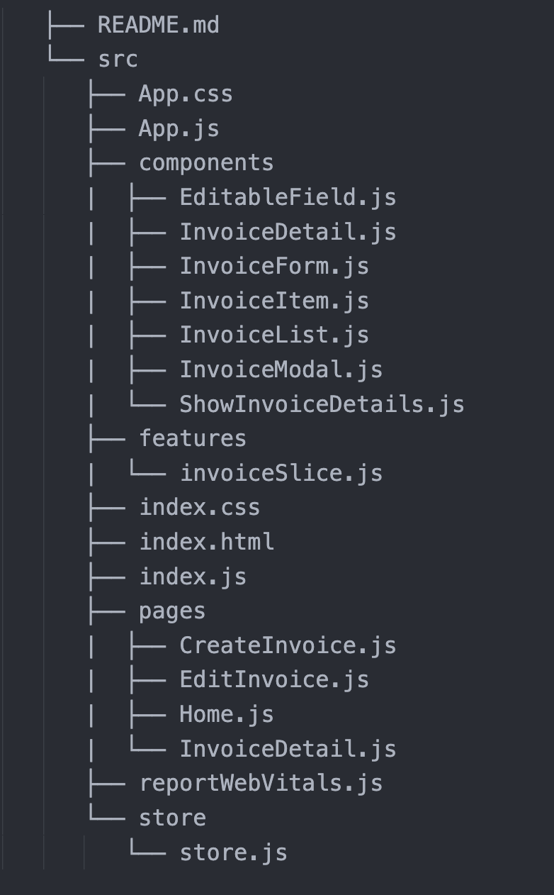

# Invoice Management System

An Invoice Management System project built using `React.js`, `Redux`, `Redux Toolkit` and `React-Bootstrap`.

# Setps To Run Locally

If you prefer to run the Invoice Management System locally on your machine, follow these steps:

1. Clone the repository using the following command:
   ```
   git clone https://github.com/Divyanshu-Madhav/PayFlow.git
   ```
2. Change the current directory to the project folder:
   ```
   cd PayFlow
   ```
3. Install project dependencies by running:
   ```
   npm install
   ```
4. Start the application with the following command:
   ```
   npm start
   ```
5. Open your web browser and visit http://localhost:3000/ to access the Invoice Management System.

# Features:

**View Invoices**:

- Users can easily view a list of their invoices with essential details like invoice number, name, and total amount.

**Edit Invoices**:

- Users have the ability to edit existing invoices to make updates or corrections to client details, itemized services, prices, or quantities.

**Copy Invoices**:

- Application allows users to create duplicate copies of invoices, making it convenient for recurring invoices.

**Delete Invoices**:

- Users can delete invoices that are no longer needed, helping them maintain a clean and organized.

**Download PDF Invoices**:

- Users can generate and download PDF versions of their invoices, which are commonly used for sharing with clients and for record-keeping.

# Project Directory Structure


